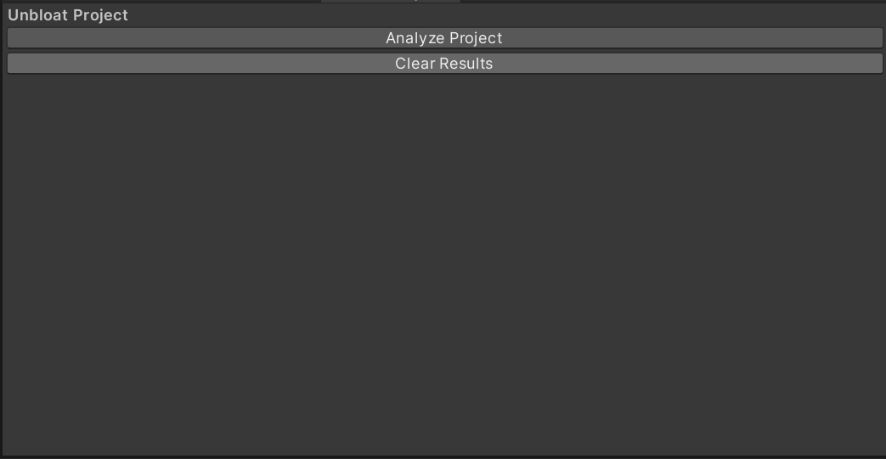
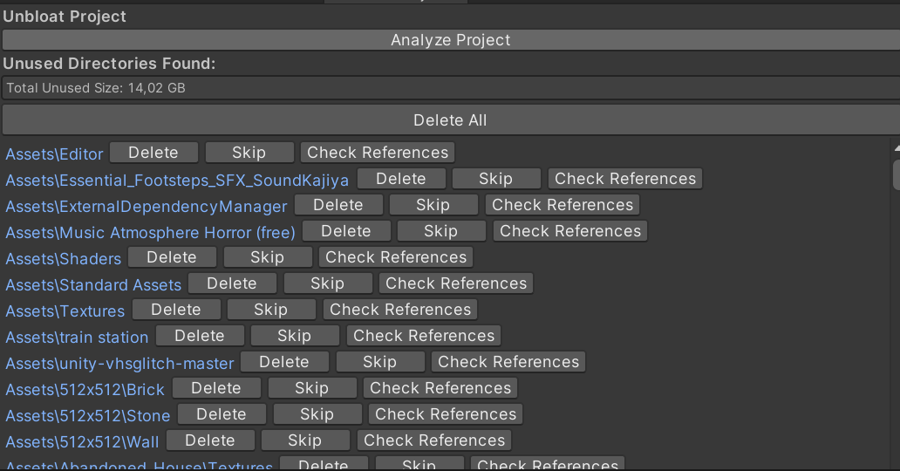

# Unbloat Project - Unity Editor Tool

This Unity Editor tool helps you identify and manage unused directories in your Unity project. It scans your project for directories that are not referenced in any active scenes or build configurations. You can delete, skip, or analyze these directories for references in build scenes, helping to optimize the project size and keep your project organized.

## Features

- **Analyze Project**: Scan your project for unused directories.
- **Check References**: Check if any assets from a directory are referenced in build scenes.
- **Delete Directories**: Safely delete unused directories and their associated files.
- **Skip Directories**: Skip a directory from the analysis and future checks.
- **Clear Results**: Clear the results to restart the analysis.

## How to Use

1. **Open the Tool**: 
   - In Unity, go to the top menu and select `Tools > Unbloat Project` to open the tool window.

2. **Analyze the Project**: 
   - Click the **Analyze Project** button to scan your project's assets for unused directories.

3. **Review Unused Directories**: 
   - If unused directories are found, they will be listed in the window. You can:
     - **Delete**: Delete the directory and its contents.
     - **Skip**: Remove the directory from the list without taking action.
     - **Check References**: Check if any assets in the directory are referenced in any build scene.

4. **Delete All**: 
   - If you wish to delete all unused directories at once, click **Delete All**.

5. **Clear Results**: 
   - If you want to clear the results and reset the tool, click **Clear Results**.

## How It Works

- The tool recursively scans directories within the `Assets` folder.
- For each directory, it checks whether any files are used or referenced in the current build scenes.
- If a directory is found to be unused, it’s added to the list of directories for potential deletion or further review.

## Screenshot

## Requirements

- Unity 2020.1 or newer
- The script works in the Unity Editor and does not require runtime configuration.

## Installation

1. Download the `UnbloatProject.cs` file.
2. Place the file inside the `Editor` folder in your Unity project (e.g., `Assets/Editor/UnbloatProject.cs`).
3. Access the tool through the `Tools > Unbloat Project` menu.

## License

This project is open-source and available under the MIT License.
